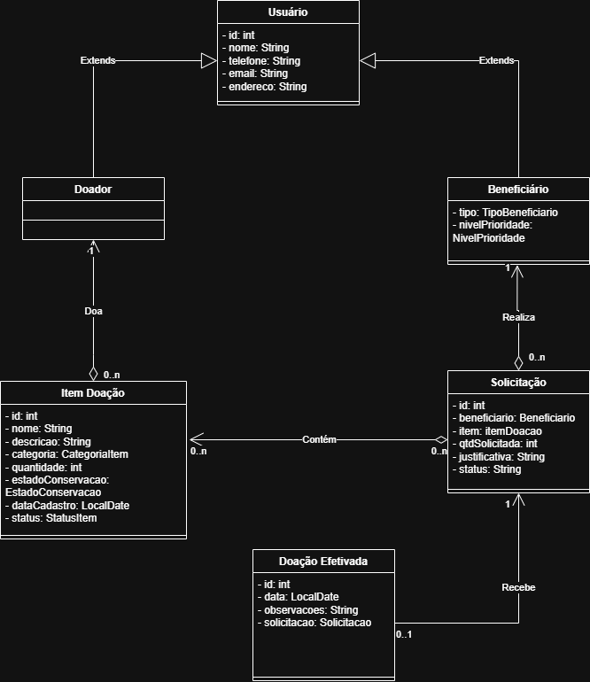

# Rede Solidária: Sistema de Doação e Reaproveitamento

## 📌 Sobre o Projeto
Este projeto é uma aplicação desenvolvida em **Java** com o objetivo de conectar doadores a instituições e pessoas em situação de vulnerabilidade. O foco é facilitar o fluxo de doações, garantindo rastreabilidade e priorização para quem mais precisa, combatendo o desperdício e promovendo a economia circular.

O projeto está alinhado com os **Objetivos de Desenvolvimento Sustentável (ODS)** da ONU:
* **ODS 1:** Erradicação da Pobreza
* **ODS 10:** Redução das Desigualdades
* **ODS 12:** Consumo e Produção Responsáveis

---

## 🚀 Status do Projeto: Checkpoint 2
Atualmente, o sistema encontra-se em estagio avançado, contendo:
- [x] Modelagem das classes principais (POO).
- [x] Diagrama de classes.
- [x] Sistema de menu via terminal.
- [x] Cadastro básico de Doadores, Beneficiários e Itens.
- [x] Solicitação de item.
- [x] Validações.
- [x] Mudança de status.
- [x] Listagens e filtros.
- [x] Tratamento de erros de entrada.

---

## 📐 Modelagem do Sistema
O sistema utiliza os conceitos de Herança e Encapsulamento para organizar os usuários e itens:

### Diagrama de Classes
 

---

## 🛠️ Tecnologias Utilizadas
* **Linguagem:** Java 17+
* **Versionamento:** Git & GitHub
* **Paradigma:** Programação Orientada a Objetos (POO)

---

## 📂 Estrutura de Pastas
```text
src/
 └── br/com/redesolidaria/
     ├── main/        # Classe de entrada e inicialização (Menu)
     ├── model/       # Classes de domínio (Doador, Beneficiário, Item)
     ├── repository/  # Gerenciamento de dados em memória
     ├── service/     # Regras de negócio.
     └── util/        # Classes utilitárias e leitores